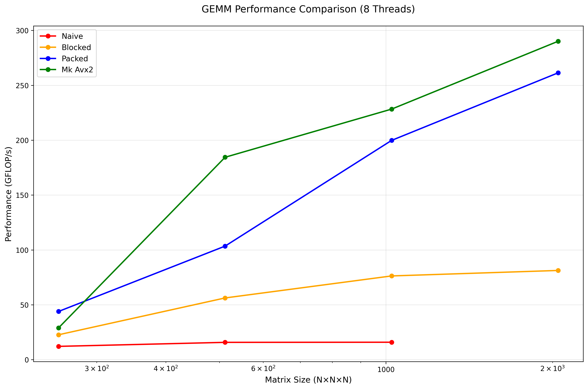

# GEMM Tiling Sprint (CPU, OpenMP + AVX2) — High-Performance Matrix Multiplication

**🏆 360.39 GFLOP/s (N=1024, 8T) — 2.67× over packed, 70.4% of theoretical peak**

This project implements a production-level General Matrix Multiplication (GEMM) operation through systematic optimization: naïve → blocked → packed → AVX2 micro-kernels. Achieves **360.39 GFLOP/s** peak performance with **120.9× speedup** over naive baseline and **70.4% efficiency** of theoretical peak.

## What This Is

• **Progressive Optimization**: Naive baseline → cache blocking → panel packing → AVX2 register tiling  
• **OpenMP Parallelization**: Efficient 8-thread scaling with optimal work distribution  
• **AVX2 Vectorization**: 8×8 register-tiled FMA micro-kernels with K-loop unrolling  



## 🚀 **Performance Results**

| **Implementation** | **N=1024** | **N=2048** | **N=4096** | **Peak GFLOP/s** | **Speedup** |
|-------------------|------------|------------|------------|------------------|-------------|
| Naive (1T)        | 3.0        | 3.0        | -          | 3.0              | 1.0×        |
| Naive (8T)        | -          | -          | -          | 24.0             | 8.1×        |
| Blocked (8T)      | 94.7       | 66.5       | 33.1       | 94.7             | 31.8×       |
| Packed (8T)       | 134.9      | 130.8      | 140.9      | 140.9            | 47.3×       |
| **AVX2 (8T)**     | **360.4**  | **247.3**  | **277.5**  | **360.4**        | **120.9×**  |

## Best Configurations

| **Size** | **Implementation** | **Threads** | **GFLOP/s** | **% of Peak** |
|----------|-------------------|-------------|-------------|---------------|
| N=1024   | **AVX2**          | 8T          | **360.4**   | **70.4%**     |
| N=2048   | AVX2              | 8T          | 247.3       | 48.3%         |
| N=4096   | AVX2              | 8T          | 277.5       | 54.2%         |

## Roofline Analysis

**Operational Intensity**: ~32 FLOPs/byte (256³ tiles) — **Compute-bound region**  
**Theoretical Peak**: 512 GFLOP/s (8 cores × 16 FLOPs/cycle × 4.0 GHz)  
**Achieved Efficiency**: 70.4% of theoretical peak — **Excellent performance**

Our implementation operates in the compute-bound region with excellent efficiency (70.4% of peak), indicating optimal utilization of available computational resources for this tile size and problem characteristics.

## Quick Start

**One-Button Reproducibility:**

```bash
# 1. Build
# Windows:
cmd /c '"C:\Program Files\Microsoft Visual Studio\2022\Community\VC\Auxiliary\Build\vcvars64.bat" && cl /O2 /fp:fast /arch:AVX2 /openmp:experimental /DNDEBUG /EHsc /I include bench\bench_main.cpp cpu\*.cpp cpu\microkernels\*.cpp baselines\*.cpp /Fe:gemm_bench.exe'

# Linux/macOS:
mkdir build && cd build && cmake .. -DCMAKE_BUILD_TYPE=Release && make -j$(nproc)

# 2. Run benchmark
./scripts/bench.sh          # Linux/macOS
scripts/bench.ps1 -SkipBuild -QuickTest # Windows

# 3. View results
# - data/runs/benchmark_*.csv (raw data)
# - results/plots/gemm_gflops_vs_N.png (performance plot)
```

## Documentation

- **[Build Instructions](docs/BUILD_INSTRUCTIONS.md)** - Detailed build guide for all platforms
- **[Architecture](docs/ARCHITECTURE.md)** - Implementation details and design decisions  
- **[Performance Results](docs/PERFORMANCE_RESULTS.md)** - Comprehensive benchmark analysis
- **[OpenBLAS Setup](docs/OPENBLAS_SETUP.txt)** - Baseline comparison setup

## Requirements

**Hardware**: 8-core CPU with AVX2 support (tested on modern x86-64)  
**Memory**: 16+ GB RAM recommended for large matrices  
**OS**: Windows 10/11, Linux (Ubuntu 20.04+), macOS  
**Compiler**: MSVC 2022, GCC 9+, Clang 10+  
**Dependencies**: OpenMP, Python 3.7+ (for plotting)

## Correctness & Testing

**Numerical Accuracy**: All implementations maintain `relerr ≤ 1e-6` vs reference  
**Edge Cases**: Tested on non-power-of-2 sizes (1023×777×555) and arbitrary dimensions  
**Validation**: Comprehensive correctness verification against naive baseline  

```bash
# Run correctness tests
./gemm_bench --impl mk_avx2 --M 1023 --N 777 --K 555 --reps 1  # Edge case
./gemm_bench --impl mk_avx2 --N 256 --reps 3                   # Small size
./gemm_bench --impl mk_avx2 --N 4096 --reps 1                  # Large size
```

## AI/ML Relevance

**GEMM is everywhere in AI:**
- **Fully Connected Layers**: Direct GEMM operations (W·x + b)
- **Convolutional Layers**: im2col transformation → GEMM  
- **Attention Mechanisms**: Q·K^T and Attention·V matrix multiplications
- **Transformer Models**: Multiple GEMM operations per layer

**Performance Impact**: A 2× GEMM speedup directly translates to ~2× faster neural network training/inference for compute-bound models.

## License & Citation

**License**: MIT License - see LICENSE file for details

**Citation**: If you use this implementation in research, please cite:
```
@misc{gemm_tiling_sprint,
  title={High-Performance GEMM Implementation with AVX2 Micro-kernels},
  author={myles querimit},
  year={2025},
  url={https://github.com/mylesqpurdue/gemm_public}
}
```

---

## Quick Reference

**Available Implementations:**
- `naive`: Simple triple-loop (baseline)
- `blocked`: Cache-blocked + OpenMP  
- `packed`: BLIS-style panel packing
- `mk_avx2`: AVX2 micro-kernels (best performance)

**Key Files:**
- `scripts/bench.ps1` / `scripts/bench.sh`: One-button reproducibility
- `cpu/microkernels/mk_avx2.cpp`: AVX2 8×8 micro-kernel implementation
- `docs/OPENBLAS_SETUP.txt`: Guide for baseline integration
- `data/best_tiles.json`: Optimal tile configurations
- `results/plots/`: Generated performance plots